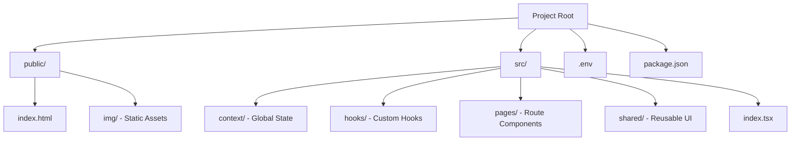

# Lazy Bunny – Movie Platform Frontend

## 📝 Project Description

Lazy Bunny is an interactive web application for discovering and tracking movies. This project was developed as part of a diploma thesis to demonstrate client-server architecture skills.

This repository contains the **frontend application** built with React and TypeScript.

The application allows users to:

- Register and log in securely.
- Maintain a list of watched movies.
- Rate movies and leave comments.
- Access an admin dashboard to manage the movie database (for administrators).

## 🚀 Features

- **Authentication:** User registration and login (JWT).
- **User Profile:** Profile management and personalized lists.
- **Movie Catalog:** Browse, search, and filter movies.
- **Social:** Commenting and rating system.
- **Administration:** Admin panel for managing movies and users.
- **UI/UX:** Responsive design for mobile and desktop.

## 🛠 Tech Stack

- **Language:** TypeScript
- **Framework:** React
- **Routing:** React Router
- **State Management:** React Context API
- **Forms:** React Hook Form
- **Styling:** CSS
- **API Requests:** Fetch API
- **Authentication:** JWT

## 🎨 Design & Architecture

- [Figma Design Link](https://www.figma.com/design/lSgKi45c1FHlTY2ZmJVZKe/Untitled?node-id=0-1&node-type=canvas&t=aKdqfdVHJvUOAvpC-0)
- [Architecture Scheme (FigJam)](https://www.figma.com/board/54Dk4yuXwkKUK6LWMj9ubF/LazyBunny-FrontEnd-Scheme?node-id=0-1&t=BauMz8cwub6znSef-1)

## ⚙️ Getting Started

### Prerequisites

- Node.js (v16 or higher)
- NPM

# Install Dependencies

```bash
npm install
```

---

# Environment Configuration

Create a `.env` file in the root directory and add your API URL:

```
REACT_APP_API_URL=http://localhost:3000/
```

---

# Run the Project

```bash
npm start
```

The application will be available at:

```
http://localhost:3000
```

---

# 📂 Project Structure



---

# 👥 Development Team

- **Yehor Honcharov** – [GitHub](https://github.com/YehorHoncharov)
- **Semen Heraimovych** – [GitHub](https://github.com/sema-gr)
- **Bohdan Rubanov** – [GitHub](https://github.com/BohdanRubanov)
